# boulty-v1 — Complete Architecture Deep-Dive

Everything about how this system works — from a browser click to a database row and back.

---

## 1. The Big Picture

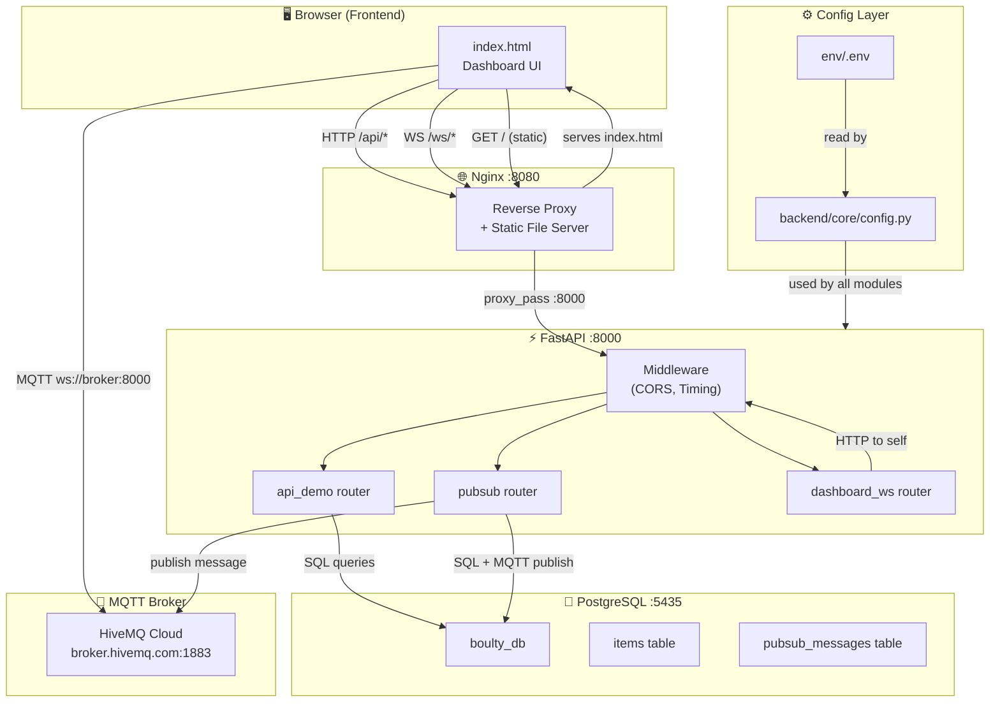

### How a request flows through the system:

```
Browser → Nginx(:8080) → FastAPI(:8000) → PostgreSQL(:5435)
                                        → MQTT Broker (HiveMQ)
                                        ↩ JSON Response back to Browser
```

---

## 2. Project Structure — Every File Explained

```
boulty-v1/
│
├── env/                           ⬅ CONFIGURATION HUB
│   ├── .env                       Actual secrets (git-ignored)
│   ├── .env.example               Template committed to git
│   └── README.md                  Documents every variable
│
├── backend/                       ⬅ PYTHON FASTAPI APPLICATION
│   ├── __init__.py                Makes backend a Python package
│   ├── main.py                    App entry point — creates FastAPI, mounts routers
│   │
│   ├── core/                      ⬅ CONFIGURATION MODULE
│   │   ├── __init__.py            Re-exports settings
│   │   └── config.py              Pydantic Settings — reads env/.env
│   │
│   ├── db/                        ⬅ DATABASE LAYER
│   │   ├── __init__.py            Re-exports Base, engine, get_db
│   │   ├── base.py                DeclarativeBase (ORM base class)
│   │   └── engine.py              Async engine, connection pool, session factory
│   │
│   ├── models/                    ⬅ DATA MODELS
│   │   ├── __init__.py            Re-exports all models
│   │   ├── schemas.py             Pydantic models (request/response validation)
│   │   └── db_models.py           SQLAlchemy ORM models (table definitions)
│   │
│   └── routers/                   ⬅ API ENDPOINTS
│       ├── __init__.py
│       ├── api_demo.py            CRUD endpoints for items
│       ├── pubsub.py              Publish/history endpoints for messaging
│       └── dashboard_ws.py        WebSocket for real-time dashboard updates
│
├── alembic/                       ⬅ DATABASE MIGRATIONS
│   ├── env.py                     Migration runner (reads config)
│   └── versions/
│       └── 001_init.py            Initial schema — creates tables + seeds data
│
├── frontend/                      ⬅ BROWSER UI
│   └── index.html                 Single-page dashboard (HTML + CSS + JS)
│
├── nginx/                         ⬅ REVERSE PROXY
│   └── nginx.conf                 Nginx configuration template
│
├── pubsub/                        ⬅ MQTT CONFIG
│   └── pubsub.conf                Local Mosquitto config (unused — using HiveMQ)
│
├── alembic.ini                    Alembic settings file
├── requirements.txt               Python dependencies
├── build.sh                       Start everything
├── stop.sh                        Stop everything
└── .gitignore                     Git ignore rules
```

---

## 3. The Build Process — What `bash build.sh` Does

When you run `bash build.sh`, here's exactly what happens step by step:

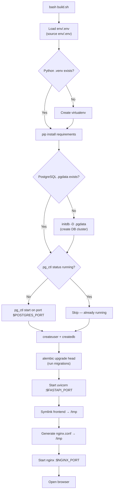

### Step-by-step:

| Step | What happens | File |
|------|-------------|------|
| **0** | Loads all env vars from `env/.env` | [build.sh:11-19](file:///Users/apple/Documents/Apps/Magesh/Learning/boulty-v1/build.sh#L11-L19) |
| **1** | Creates Python virtualenv if missing, installs deps | [build.sh:23-29](file:///Users/apple/Documents/Apps/Magesh/Learning/boulty-v1/build.sh#L23-L29) |
| **3** | Initializes PostgreSQL data directory if first run | [build.sh:33-36](file:///Users/apple/Documents/Apps/Magesh/Learning/boulty-v1/build.sh#L33-L36) |
| **3b** | Starts PostgreSQL on `$POSTGRES_PORT` | [build.sh:39-42](file:///Users/apple/Documents/Apps/Magesh/Learning/boulty-v1/build.sh#L39-L42) |
| **3c** | Creates DB user + database | [build.sh:44-45](file:///Users/apple/Documents/Apps/Magesh/Learning/boulty-v1/build.sh#L44-L45) |
| **3d** | Runs Alembic migrations (creates tables) | [build.sh:46](file:///Users/apple/Documents/Apps/Magesh/Learning/boulty-v1/build.sh#L46) |
| **4** | Starts FastAPI via uvicorn | [build.sh:49-55](file:///Users/apple/Documents/Apps/Magesh/Learning/boulty-v1/build.sh#L49-L55) |
| **5** | Starts Nginx reverse proxy | [build.sh:58-71](file:///Users/apple/Documents/Apps/Magesh/Learning/boulty-v1/build.sh#L58-L71) |
| **6** | Opens browser | [build.sh:74-75](file:///Users/apple/Documents/Apps/Magesh/Learning/boulty-v1/build.sh#L74-L75) |

---

## 4. Nginx — Reverse Proxy & Load Balancing

### What Nginx does here:

[nginx.conf](file:///Users/apple/Documents/Apps/Magesh/Learning/boulty-v1/nginx/nginx.conf) configures Nginx as a **reverse proxy** that sits between the browser and FastAPI:

```
Browser (:8080)  →  Nginx  →  FastAPI (:8000)
                           →  Static files (index.html)
```

### Routing Rules:

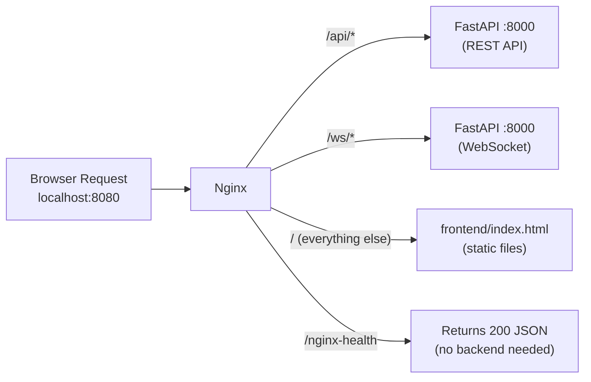

| URL Pattern | Where it goes | Purpose |
|-------------|--------------|---------|
| `/api/*` | proxy to FastAPI :8000 | All REST API calls |
| `/ws/*` | proxy to FastAPI :8000 | WebSocket connections |
| `/` | serves `frontend/index.html` | Static dashboard UI |
| `/nginx-health` | Nginx itself returns JSON | Health check endpoint |

### How Load Balancing Works:

Currently the `upstream` block defines a **single backend**:

```nginx
upstream fastapi_backend {
    server 127.0.0.1:8000;
}
```

> [!TIP]
> **To add load balancing**, you would add more servers and choose a strategy:
> ```nginx
> upstream fastapi_backend {
>     # Round-robin (default) — each request goes to the next server
>     server 127.0.0.1:8000;
>     server 127.0.0.1:8001;
>     server 127.0.0.1:8002;
>
>     # Or use least_conn — send to the server with fewest active connections
>     # least_conn;
>
>     # Or use ip_hash — same client always hits the same server (sticky sessions)
>     # ip_hash;
> }
> ```

### Load Balancing Strategies:

| Strategy | Behavior | Best For |
|----------|----------|----------|
| **Round Robin** (default) | Alternates between servers 1→2→3→1→2→3 | Stateless APIs |
| **Least Connections** | Sends to server with fewest active requests | Varying request durations |
| **IP Hash** | Same client IP always → same server | Sticky sessions, WebSocket |
| **Weight** | `server :8000 weight=3;` — 3x more traffic | Stronger/weaker servers |

### WebSocket Proxy:

Nginx is configured with special headers for WebSocket support:

```nginx
proxy_http_version 1.1;
proxy_set_header Upgrade $http_upgrade;      # ← "upgrade to websocket"
proxy_set_header Connection "upgrade";        # ← required for WS handshake
```

The `/ws/` location has long timeouts (`3600s` = 1 hour) because WebSocket connections are persistent.

### Custom Headers:

Every proxied request gets these headers added by Nginx:

```
X-Real-IP: 192.168.1.10           ← client's actual IP
X-Forwarded-For: 192.168.1.10     ← chain of proxies
X-Forwarded-Proto: http            ← original protocol
X-Nginx-Proxy: true               ← proves it went through Nginx
```

---

## 5. FastAPI Backend — The Application

### Application Setup — [main.py](file:///Users/apple/Documents/Apps/Magesh/Learning/boulty-v1/backend/main.py)

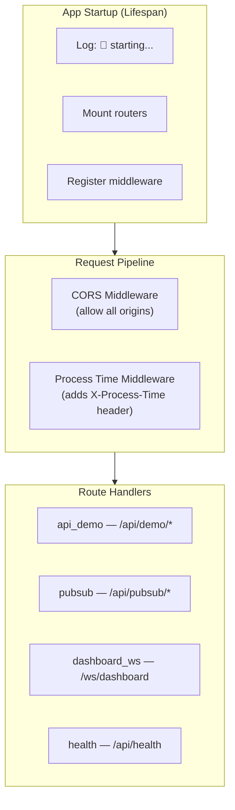

### Request Lifecycle:

Every HTTP request goes through this pipeline:

```
1. Request arrives at FastAPI (:8000)
       ↓
2. CORS middleware — adds Access-Control headers
       ↓
3. Process-time middleware — starts timer
       ↓
4. Router matches URL pattern → handler function
       ↓
5. Handler gets DB session via get_db dependency
       ↓
6. Handler executes SQL query via SQLAlchemy
       ↓
7. Response built → middleware adds X-Process-Time header
       ↓
8. JSON response sent back to client
```

### CORS Middleware:

```python
app.add_middleware(
    CORSMiddleware,
    allow_origins=["*"],        # Accept requests from ANY domain
    allow_credentials=True,
    allow_methods=["*"],        # Allow GET, POST, PATCH, DELETE, etc.
    allow_headers=["*"],        # Allow any header
)
```

This means any website can call your API. In production, you'd restrict `allow_origins` to your actual domain.

### Timing Middleware:

```python
@app.middleware("http")
async def add_process_time_header(request, call_next):
    t0 = time.time()
    response = await call_next(request)          # actually run the handler
    elapsed = round((time.time() - t0) * 1000)  # calculate ms
    response.headers["X-Process-Time"] = f"{elapsed}ms"
    response.headers["X-Server"] = "boulty-v1"
    return response
```

Every response includes:
- `X-Process-Time: 12.5ms` — how long the backend took
- `X-Server: boulty-v1` — which server handled it

---

## 6. API Endpoints — Complete Reference

### 6.1 Items CRUD — [api_demo.py](file:///Users/apple/Documents/Apps/Magesh/Learning/boulty-v1/backend/routers/api_demo.py)

| Method | Endpoint | Purpose | SQL Operation |
|--------|----------|---------|---------------|
| `GET` | `/api/demo/items` | List all items (paginated) | `SELECT ... LIMIT offset` |
| `GET` | `/api/demo/items/{id}` | Get single item | `SELECT ... WHERE id=?` |
| `POST` | `/api/demo/items` | Create new item | `INSERT INTO items ...` |
| `PATCH` | `/api/demo/items/{id}` | Partial update | `UPDATE items SET ... WHERE id=?` |
| `DELETE` | `/api/demo/items/{id}` | Delete item | `DELETE FROM items WHERE id=?` |
| `GET` | `/api/demo/health` | Backend health + DB count | `SELECT count(*) FROM items` |
| `GET` | `/api/demo/stats` | Uptime, version, counts | `SELECT count(*) FROM items` |

#### How `GET /api/demo/items` Works:

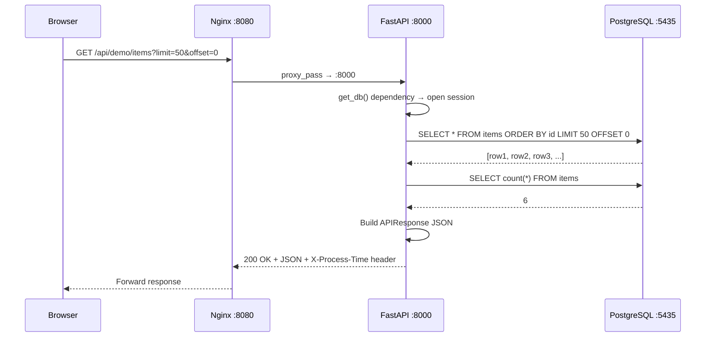

#### How `POST /api/demo/items` Works:

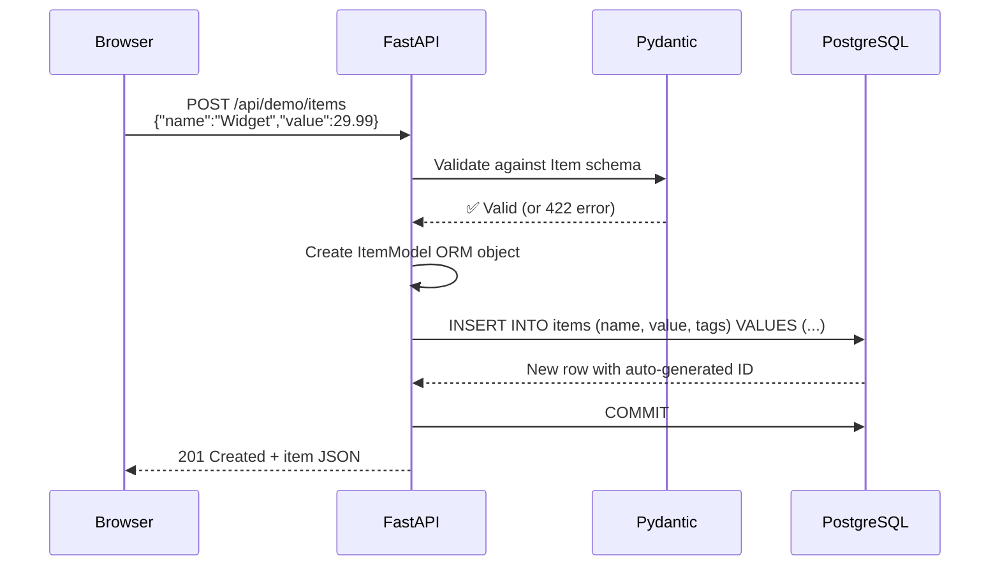

#### How `PATCH /api/demo/items/{id}` Works:

```python
# Only updates the fields you send — partial update
patch = update.model_dump(exclude_unset=True)  # e.g. {"name": "New Name"}
for key, val in patch.items():
    setattr(item, key, val)  # item.name = "New Name"
await db.flush()  # sends UPDATE to DB
```

### 6.2 PubSub — [pubsub.py](file:///Users/apple/Documents/Apps/Magesh/Learning/boulty-v1/backend/routers/pubsub.py)

| Method | Endpoint | Purpose |
|--------|----------|---------|
| `POST` | `/api/pubsub/publish` | Publish a message (saves to DB + sends to MQTT) |
| `GET` | `/api/pubsub/history/{channel}` | Get past messages for a channel |
| `GET` | `/api/pubsub/channels` | List channels info |

#### How Publishing Works — The Dual Write:

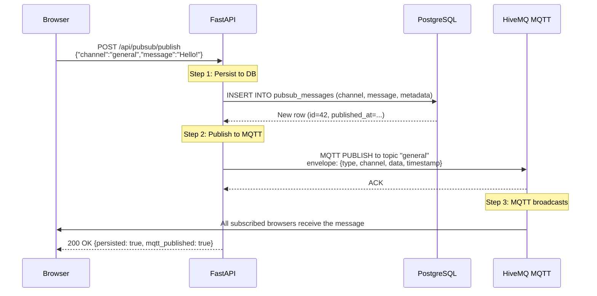

> [!IMPORTANT]
> **Why two writes?**
> - **PostgreSQL** = permanent storage (message history survives restarts)
> - **MQTT** = real-time delivery (instant push to all subscribers)
> 
> If MQTT fails, the message is still saved to DB. The response tells you: `mqtt_published: false`.

### 6.3 Dashboard WebSocket — [dashboard_ws.py](file:///Users/apple/Documents/Apps/Magesh/Learning/boulty-v1/backend/routers/dashboard_ws.py)

This replaces HTTP polling with a persistent WebSocket connection.

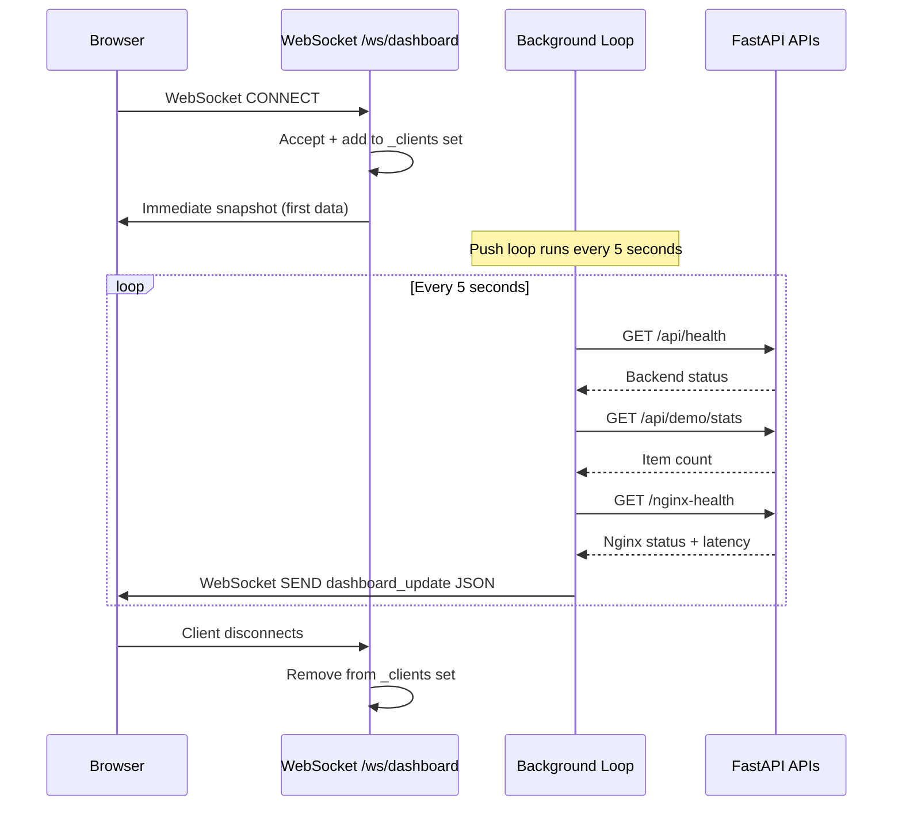

#### Key Design Decisions:

| Feature | How it works |
|---------|-------------|
| **Singleton push loop** | Only one `_push_loop` task runs, no matter how many clients connect |
| **Client tracking** | `_clients: Set[WebSocket]` — O(1) add/remove/iterate |
| **Dead client cleanup** | If `send_text()` fails, client is silently removed |
| **Immediate data** | New client gets a snapshot instantly, doesn't wait 5 seconds |

---

## 7. PostgreSQL — Database Deep-Dive

### Connection Architecture:

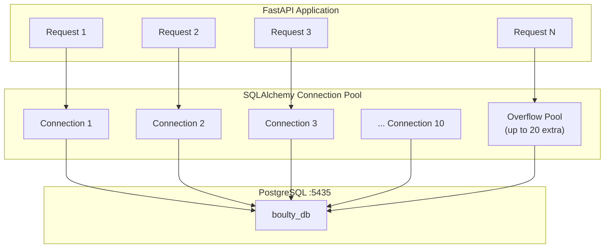

### Connection Pool Settings — [engine.py](file:///Users/apple/Documents/Apps/Magesh/Learning/boulty-v1/backend/db/engine.py)

```python
engine = create_async_engine(
    settings.async_database_url,          # postgresql+asyncpg://boulty@localhost:5435/boulty_db
    echo=settings.DB_ECHO,                # Log SQL? (default: false)
    pool_size=settings.DB_POOL_SIZE,      # 10 persistent connections
    max_overflow=settings.DB_MAX_OVERFLOW, # 20 extra under load
    pool_pre_ping=True,                   # Health-check before reuse
)
```

| Setting | Value | What it means |
|---------|-------|--------------|
| `pool_size=10` | 10 connections are kept alive permanently | These are reused across requests |
| `max_overflow=20` | Up to 20 extra temp connections | Created under heavy load, closed when done |
| `pool_pre_ping=True` | Test connection before using it | Prevents "connection reset" errors |
| **Max concurrent** | **30** (10 + 20) | Total connections to PostgreSQL at once |

### How `get_db()` Works — The Session Lifecycle:

```python
async def get_db() -> AsyncSession:
    async with AsyncSessionLocal() as session:  # 1. Borrow connection from pool
        try:
            yield session                        # 2. Handler uses session
            await session.commit()               # 3. Success → COMMIT transaction
        except Exception:
            await session.rollback()             # 3. Failure → ROLLBACK transaction
            raise
        finally:
            await session.close()                # 4. Return connection to pool
```

```
Request arrives
    ↓
get_db() opens session (borrows connection from pool)
    ↓
Handler runs queries (all in one transaction)
    ↓
Success? → COMMIT | Error? → ROLLBACK
    ↓
Session closed (connection returned to pool — NOT closed)
    ↓
Next request reuses the same connection
```

### Database Tables & Schema:

#### `items` table:

```sql
CREATE TABLE items (
    id          SERIAL PRIMARY KEY,           -- auto-increment
    name        VARCHAR(255) NOT NULL,
    description TEXT,
    value       FLOAT,
    tags        JSONB NOT NULL DEFAULT '[]',  -- PostgreSQL native JSON
    created_at  TIMESTAMPTZ DEFAULT now(),
    updated_at  TIMESTAMPTZ DEFAULT now()
);
```

#### `pubsub_messages` table:

```sql
CREATE TABLE pubsub_messages (
    id           SERIAL PRIMARY KEY,
    channel      VARCHAR(100) NOT NULL,
    message      TEXT NOT NULL,
    metadata     JSONB NOT NULL DEFAULT '{}',
    published_at TIMESTAMPTZ DEFAULT now()
);
```

### Indexing — How Queries Are Faster

Indexes are defined in the [migration file](file:///Users/apple/Documents/Apps/Magesh/Learning/boulty-v1/alembic/versions/001_init.py) and [ORM models](file:///Users/apple/Documents/Apps/Magesh/Learning/boulty-v1/backend/models/db_models.py):

| Table | Index | Column(s) | Why |
|-------|-------|-----------|-----|
| `items` | Primary Key (B-tree) | `id` | Fast lookup by ID: `GET /items/3` |
| `pubsub_messages` | Primary Key (B-tree) | `id` | Fast lookup by ID |
| `pubsub_messages` | `ix_pubsub_messages_channel` | `channel` | Fast filter: `WHERE channel = 'general'` |
| `pubsub_messages` | `ix_pubsub_messages_published_at` | `published_at` | Fast sort: `ORDER BY published_at DESC` |

#### How B-tree Indexes Work:

```
Without index:  Scan ALL rows → O(n)
                items: [1] [2] [3] [4] [5] [6] ... [10000]
                       ← check every single row ─→

With index:     Binary search → O(log n)
                        [500]
                       /     \
                   [250]     [750]
                   /   \     /   \
                [125] [375] [625] [875]
                ↳ Jump directly to id=375 in 3 steps instead of 375 steps
```

#### When the indexes help:

```sql
-- Uses PRIMARY KEY index (items.id) → instant lookup
SELECT * FROM items WHERE id = 3;

-- Uses ix_pubsub_messages_channel index → fast filter
SELECT * FROM pubsub_messages WHERE channel = 'general';

-- Uses ix_pubsub_messages_published_at index → fast sort
SELECT * FROM pubsub_messages ORDER BY published_at DESC LIMIT 50;

-- Combines channel index + published_at index
SELECT * FROM pubsub_messages
WHERE channel = 'general'
ORDER BY published_at DESC LIMIT 50;
```

### PostgreSQL Replication (Not Currently Configured)

The current setup uses a **single-node** PostgreSQL instance (`.pgdata/` directory). Here's how you'd add replicas:

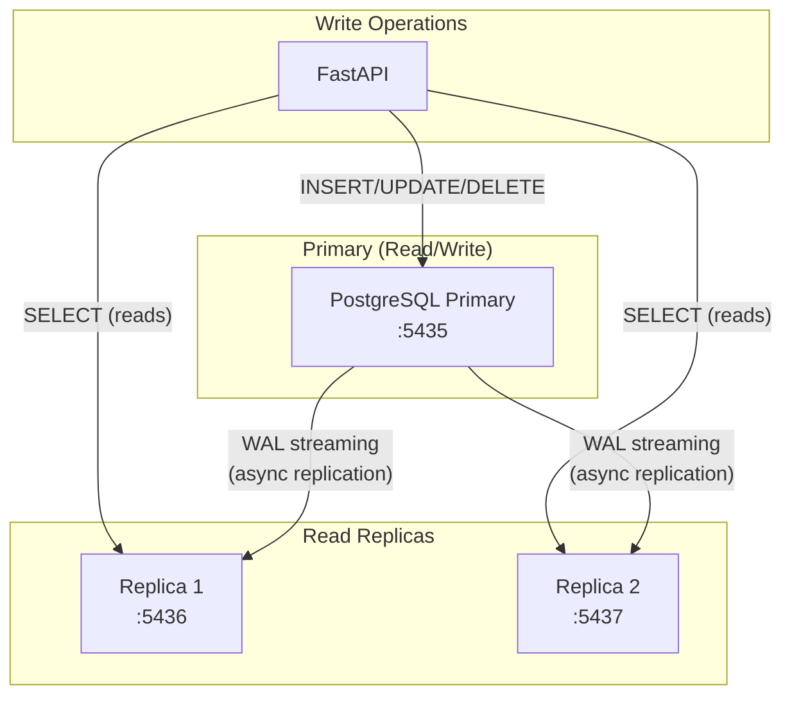

> [!NOTE]
> **Replication types in PostgreSQL:**
> - **Streaming Replication**: Primary sends WAL (Write-Ahead Log) to replicas in real-time
> - **Synchronous**: Primary waits for replica to confirm write (slower but consistent)
> - **Asynchronous**: Primary doesn't wait (faster but replica may lag behind)
> - **Logical Replication**: Selective — replicate specific tables only

---

## 8. MQTT PubSub System — Real-Time Messaging

### Architecture:

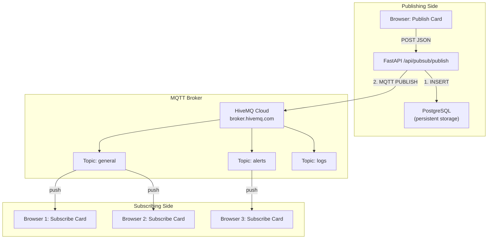

### Message Flow — Step by Step:

```
1. User types message in "Publish" card, clicks 🚀
       ↓
2. Browser sends POST to /api/pubsub/publish via Nginx
       ↓
3. FastAPI validates the JSON with Pydantic (PublishMessage schema)
       ↓
4. FastAPI INSERTs message into pubsub_messages table (PostgreSQL)
       ↓
5. FastAPI opens MQTT connection to broker.hivemq.com:1883
       ↓
6. FastAPI PUBLISHes JSON envelope to the MQTT topic (channel name)
       ↓
7. HiveMQ broker pushes the message to ALL subscribed clients
       ↓
8. Browser's MQTT.js client receives the message via WebSocket
       ↓
9. JavaScript parses JSON and adds message to the live feed
```

### Two Different Connections:

| Connection | Protocol | Port | Direction | Purpose |
|-----------|----------|------|-----------|---------|
| Backend → HiveMQ | MQTT (TCP) | 1883 | FastAPI publishes | Server-side message publish |
| Browser → HiveMQ | MQTT over WebSocket | 8000 | Browser subscribes | Client-side real-time receive |

> [!IMPORTANT]
> The browser connects **directly to HiveMQ** (not through your Nginx/FastAPI). This means messages arrive instantly without going through your server for the subscribe side.

### MQTT Topics = Channels:

```
Topic "general"     → All messages sent to channel "general"
Topic "alerts"      → All messages sent to channel "alerts"
Topic "boulty/logs" → You can use / for hierarchy
```

Any browser subscribed to topic `"general"` receives every message published to `"general"`.

---

## 9. WebSocket Dashboard — Real-Time Updates

### How it replaces HTTP polling:

```
❌ OLD WAY (HTTP Polling):
   Browser: GET /health  → wait 5s → GET /health → wait 5s → ...
   Problem: Constant new connections, wasted resources

✅ NEW WAY (WebSocket Push):
   Browser: CONNECT /ws/dashboard (one time)
   Server: Pushes data every 5 seconds over same connection
   Benefit: Single persistent connection, server controls timing
```

### Connection Lifecycle:

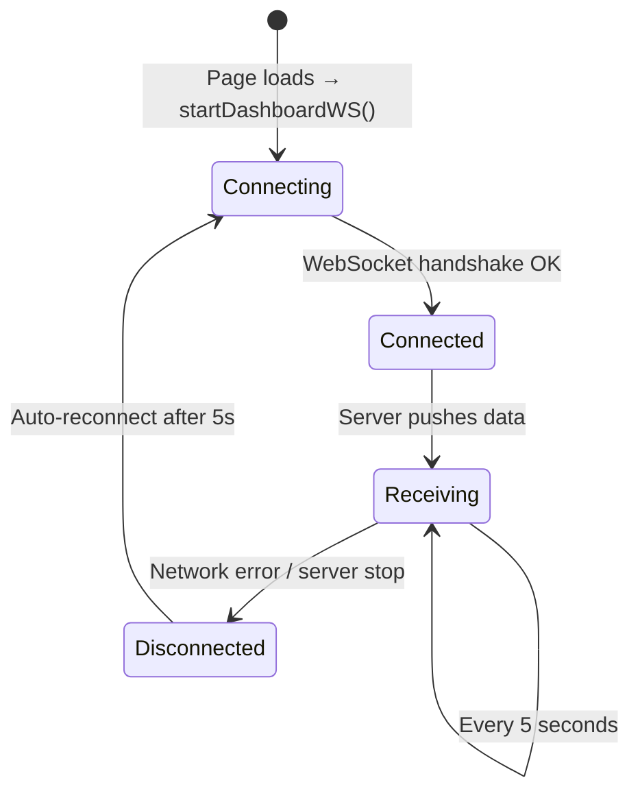

### Data Payload (sent every 5 seconds):

```json
{
    "type": "dashboard_update",
    "timestamp": 1716713400.123,
    "backend": {
        "status": "ok",
        "uptime_human": "2h 30m 15s",
        "version": "1.0.0",
        "items_count": 6
    },
    "networking": {
        "nginx_ok": true,
        "latency_ms": 12,
        "x_process_time": "12ms",
        "x_server": "nginx"
    }
}
```

---

## 10. Configuration System — [config.py](file:///Users/apple/Documents/Apps/Magesh/Learning/boulty-v1/backend/core/config.py)

### How settings flow through the system:

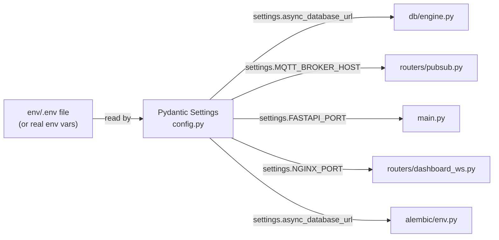

### Priority Order (highest wins):

```
1. Real environment variables    ← export POSTGRES_PORT=5436
2. env/.env file values          ← POSTGRES_PORT=5435
3. Default values in config.py   ← POSTGRES_PORT: int = 5435
```

This means you can override any setting without editing files:
```bash
POSTGRES_PORT=5436 python -m uvicorn backend.main:app
```

---

## 11. Alembic Migrations — Schema Management

### What Alembic does:

Alembic tracks your database schema changes like **git for your database**.

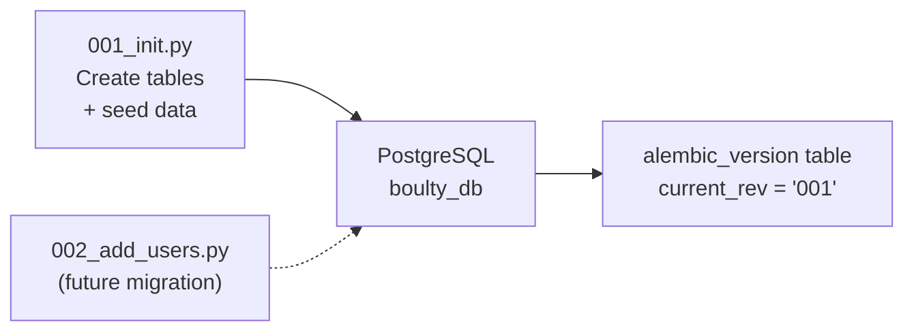

### How `alembic upgrade head` works:

```
1. Read alembic_version table → current revision = "001"
2. Find all migration files in alembic/versions/
3. Calculate path: current ("001") → latest ("001") = nothing to do
4. If there were new migrations, run them in order
```

### The initial migration — [001_init.py](file:///Users/apple/Documents/Apps/Magesh/Learning/boulty-v1/alembic/versions/001_init.py):

```
upgrade():
  1. CREATE TABLE items (...)
  2. INSERT 3 seed items (Widget Alpha, Beta, Gamma)
  3. CREATE TABLE pubsub_messages (...)
  4. CREATE INDEX on channel
  5. CREATE INDEX on published_at

downgrade():
  1. DROP TABLE pubsub_messages
  2. DROP TABLE items
```

---

## 12. Frontend Dashboard — [index.html](file:///Users/apple/Documents/Apps/Magesh/Learning/boulty-v1/frontend/index.html)

### Architecture:

Single HTML file with embedded CSS + JavaScript. No build tools, no frameworks.

```
┌─────────────────────────────────────────────────┐
│  ⚡ boulty-v1                                   │
│  Local Full-Stack Dashboard                      │
├─────────────────────┬───────────────────────────┤
│  🖥️ Backend Status   │  🌐 Networking            │
│  Status: ● online   │  Proxy: Nginx → FastAPI   │
│  Uptime: 2h 30m     │  Latency: 12ms            │
│  Items: 6           │  [Latency History Bars]   │
│  Version: 1.0.0     │                           │
├─────────────────────┼───────────────────────────┤
│  📥 PubSub Subscribe │  📤 PubSub Publish        │
│  Channel: [general] │  Channel: [general]       │
│  [▶ Connect]        │  Message: [_________]     │
│  Messages: 5        │  [🚀 Publish]             │
│  ┌── Live Feed ──┐  │  ┌── Response ──────┐    │
│  │💬 Hello world │  │  │ {success: true}  │    │
│  │⚙️ Connected   │  │  │                  │    │
│  └───────────────┘  │  └──────────────────┘    │
├─────────────────────┴───────────────────────────┤
│  🔧 API Tester                                   │
│  [GET] [POST] [PATCH] [DELETE]                   │
│  URL: [/api/demo/items]                          │
│  Body: [{"name":"Widget",...}]                   │
│  [▶ Send Request]  [📋 GET] [➕ POST] ...       │
│  Response: {"success":true, "data":{...}}        │
└──────────────────────────────────────────────────┘
```

### Data Sources:

| Card | Data Source | Protocol |
|------|-----------|----------|
| Backend Status | `/ws/dashboard` WebSocket (auto-push every 5s) | WebSocket |
| Networking | `/ws/dashboard` WebSocket (auto-push every 5s) | WebSocket |
| PubSub Subscribe | Direct to `broker.hivemq.com:8000/mqtt` | MQTT over WS |
| PubSub Publish | `POST /api/pubsub/publish` via Nginx | HTTP |
| API Tester | User-chosen endpoint via Nginx | HTTP |

---

## 13. Complete Request Flow — End to End Example

### Example: User creates an item via API Tester

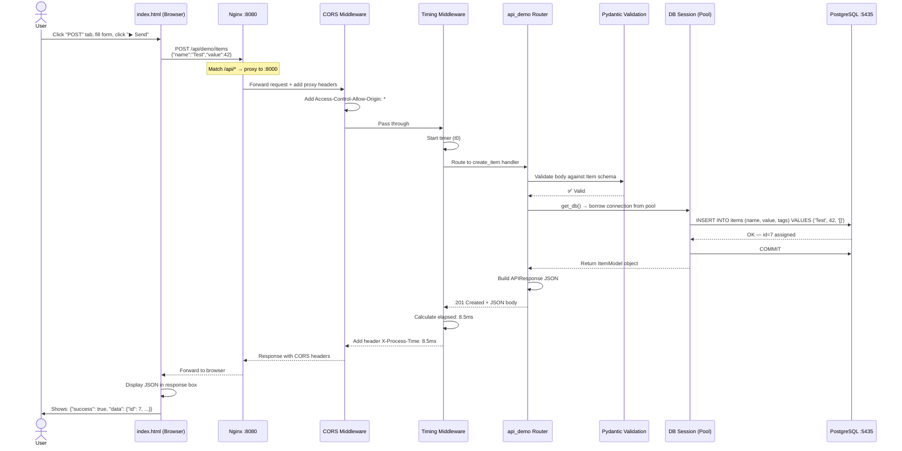

---

## Summary Table

| Component | Technology | Port | Role |
|-----------|-----------|------|------|
| **Frontend** | HTML/CSS/JS | — | Dashboard UI (served as static file) |
| **Nginx** | Nginx | 8080 | Reverse proxy, static files, load balancer |
| **Backend** | FastAPI + Uvicorn | 8000 | REST API, WebSocket, business logic |
| **Database** | PostgreSQL + asyncpg | 5435 | Persistent storage, ACID transactions |
| **Migrations** | Alembic | — | Schema version control |
| **PubSub** | HiveMQ MQTT | 1883/8000 | Real-time message broker |
| **Config** | Pydantic Settings | — | Centralized env configuration |
| **ORM** | SQLAlchemy 2.0 (async) | — | Object-relational mapping |